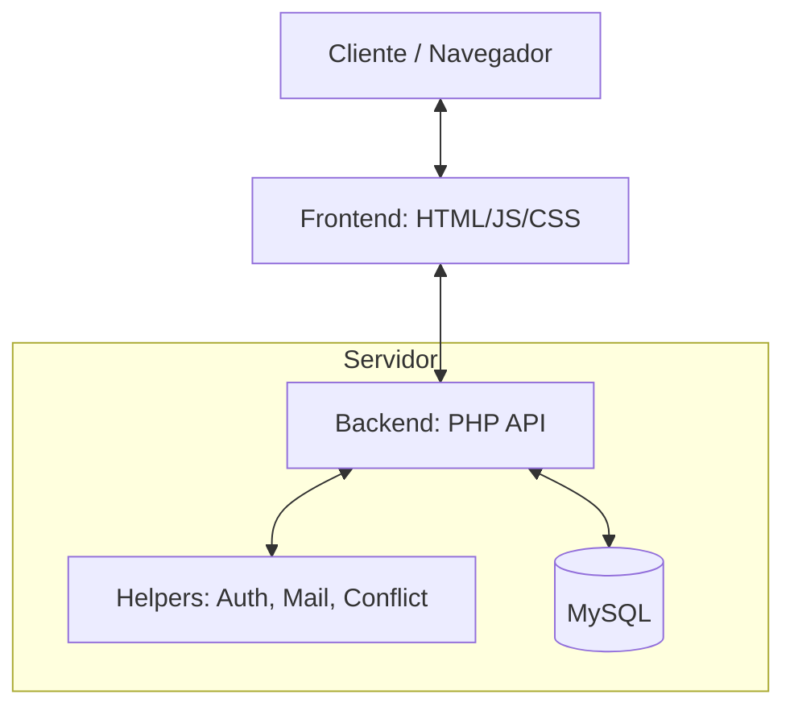

# Vista General de la Arquitectura - Academia Musical JACQUIN

Este documento proporciona una visión de alto nivel de cómo interactúan los componentes del sistema.

## 1. Stack Tecnológico

- **Frontend**: HTML5, CSS3 (Vanilla), JavaScript (ES6+). Diseño responsivo y animaciones micro-interactivas.
- **Backend**: PHP 8.x nativo. Estructura basada en servicios RESTful simulados (endpoints directos).
- **Base de Datos**: MySQL / MariaDB.
- **Servidor Local**: XAMPP (Apache + MySQL/MariaDB).
- **Exposición Externa**: Zrok (Túnel seguro).

## 2. Estructura de Capas

## 3. Estrategia de Seguridad

1.  **Validación de Sesión**: Centralizada en `helpers/auth_helper.php`. Cada endpoint administrativo llama a este helper antes de procesar datos.
2.  **Protección de Datos**: Todas las entradas son filtradas y consultadas mediante **Sentencias Preparadas (PDO)** para evitar Inyección SQL (SQLi).
3.  **Gestión de Archivos**: Los uploads son controlados y almacenados en rutas fuera de la raíz del sistema cuando es posible, o protegidos mediante `.htaccess`.
4.  **Cifrado**: Las contraseñas nunca se guardan en texto plano; se utiliza `password_hash()` y `password_verify()`.

## 4. Estructura de Caramelos (Filesystem)

- `/web_page`: Contiene la lógica de presentación.
- `/jacquin_api`: Contiene la lógica de negocio y datos.
- `/Technical_Design`: Documentación técnica de ingeniería (este documento).
