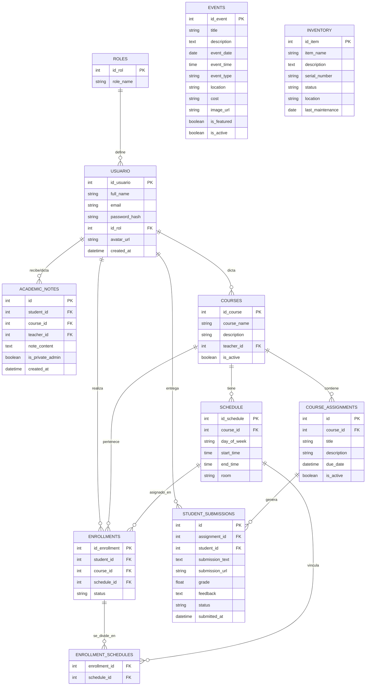

# Diagrama de Entidad Relación (ERD) - Academia Musical JACQUIN

Este documento detalla la estructura de la base de datos del sistema, utilizando la notación de Mermaid para representar las tablas y sus relaciones.

## Descripción de Relaciones Clave

1.  **USUARIO - ENROLLMENTS**: Un usuario (estudiante) puede tener múltiples inscripciones a diferentes cursos.
2.  **COURSES - SCHEDULE**: Un curso puede tener uno o múltiples horarios asignados (ej. Lunes y Miércoles).
3.  **ENROLLMENT_SCHEDULES**: Tabla intermedia que maneja la relación de muchos a muchos entre una inscripción específica y los horarios exactos asistidos, permitiendo flexibilidad si un alumno solo asiste a una parte de los horarios del curso.
4.  **USUARIO (Docente) - COURSES**: Un usuario con rol de docente es asignado a dictar uno o varios cursos.
5.  **COURSE_ASSIGNMENTS - STUDENT_SUBMISSIONS**: Cada tarea creada en un curso puede recibir múltiples entregas (una por cada estudiante inscrito).
