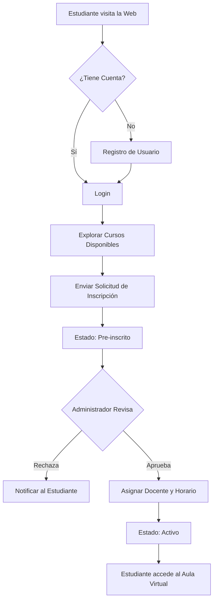
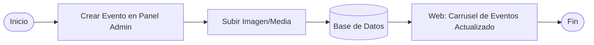
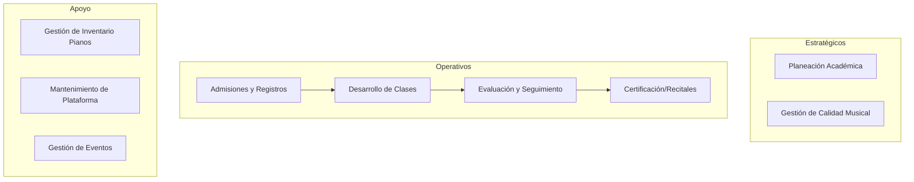

# Diagramas de Flujo y Mapas de Proceso - Academia Musical JACQUIN

Este documento describe los procesos núcleo del sistema mediante diagramas de flujo.

## 1. Proceso de Registro e Inscripción de Estudiantes

Este flujo describe desde que el estudiante se registra hasta que el administrador aprueba su cupo y le asigna un horario.

## 2. Proceso de Gestión de Eventos (Admin)

## 3. Mapa de Procesos de Negocio

El sistema se divide en tres macro-procesos:

1.  **Gestión Académica**: Control de cursos, horarios, inscripciones y calificaciones.
2.  **Gestión de Talento y Activos**: Control de docentes e inventario de instrumentos (Pianos).
3.  **Gestión de Comunidad**: Publicación de eventos y comunicación con interesados.

