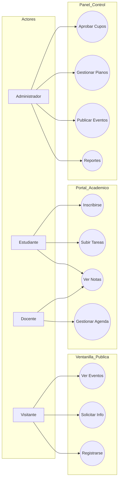

# Casos de Uso del Sistema - Academia Musical JACQUIN

Este documento identifica a los actores y sus interacciones con el sistema.

## Actores Principales

| Actor | Descripción |
| :--- | :--- |
| **Estudiante** | Persona interesada en aprender música, puede inscribirse, ver sus notas y subir tareas. |
| **Docente** | Profesional encargado de dictar las clases, calificar y gestionar el material académico. |
| **Administrador** | Encargado de la supervisión global, gestión de usuarios, inventario y eventos. |
| **Visitante** | Persona no registrada que solo puede ver la información pública y eventos. |

## Diagrama de Casos de Uso

## Detalle de Casos de Uso Críticos

### CU-04: Inscripción a Curso
- **Actor**: Estudiante.
- **Precondición**: Estar autenticado.
- **Flujo**: El estudiante elige un curso, envía solicitud, y queda en espera de aprobación.
- **Postcondición**: El registro cambia a 'Pre-inscrito'.

### CU-09: Gestión de Inventario (Pianos)
- **Actor**: Administrador.
- **Flujo**: El administrador registra nuevos instrumentos, asigna números de serie y verifica el estado de mantenimiento.
- **Importancia**: Crítico para asegurar que los recursos físicos estén disponibles para las clases.
