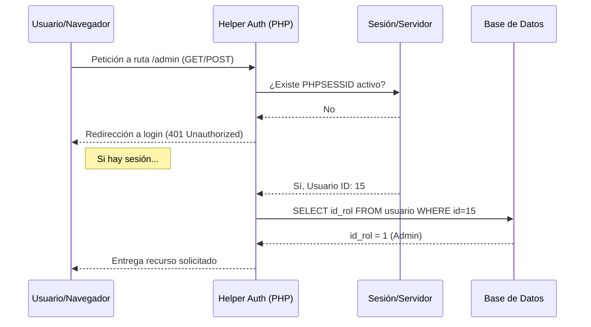
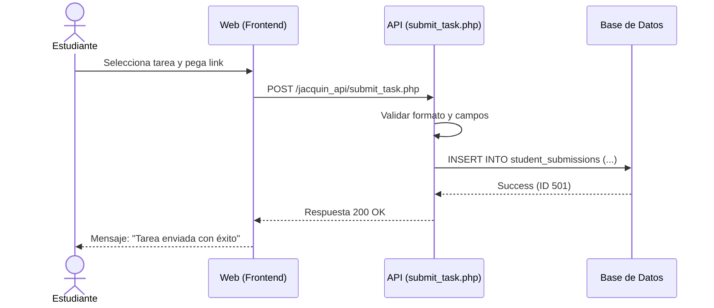

# Diagramas de Secuencia - Academia Musical JACQUIN

Estos diagramas representan la interacción temporal entre los componentes del sistema para procesos críticos.

## 1. Validación de Sesión y Acceso (Middleware)

Este flujo ocurre cada vez que un usuario intenta acceder a una ruta protegida.

## 2. Proceso de Entrega de Tarea (Student Assignment)

