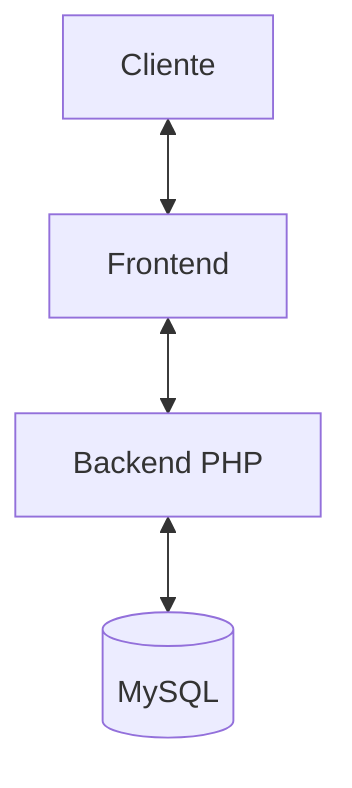
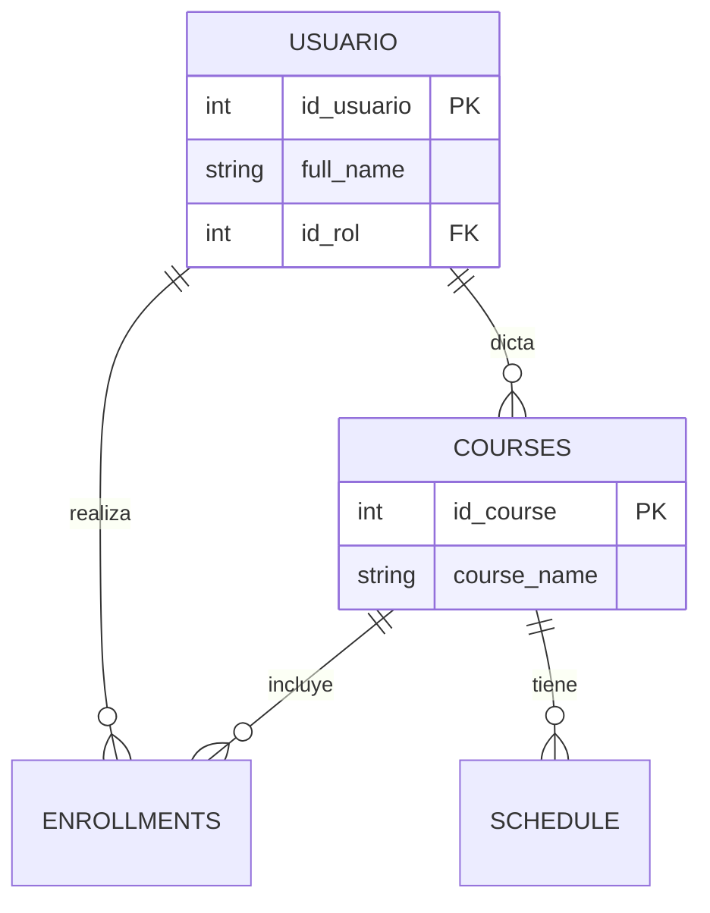
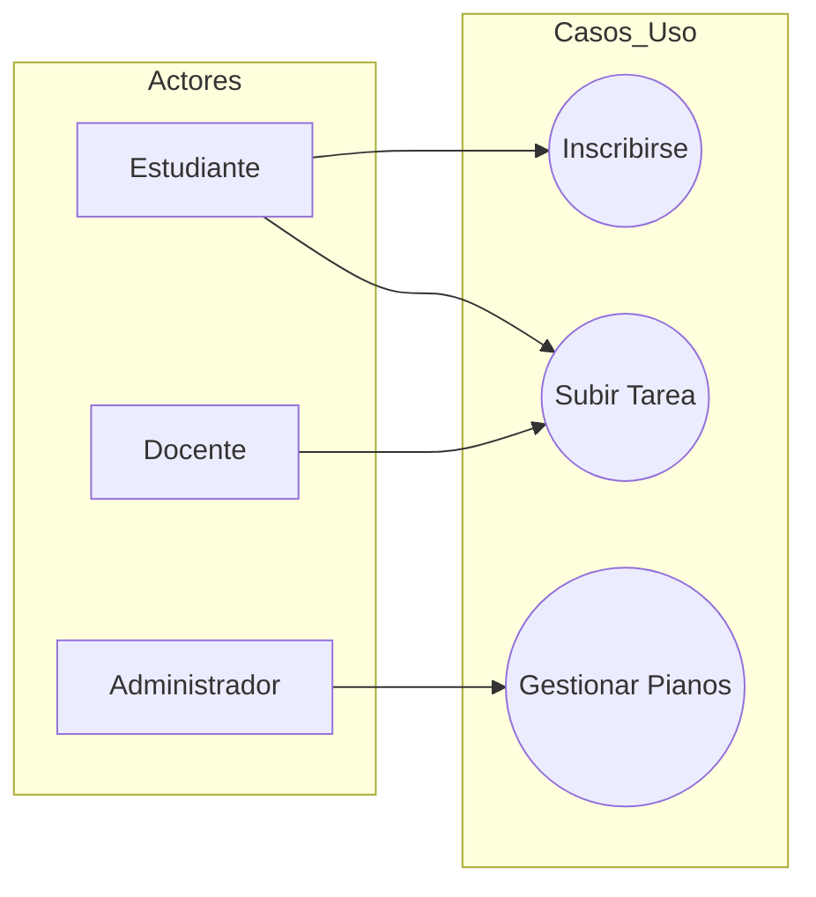
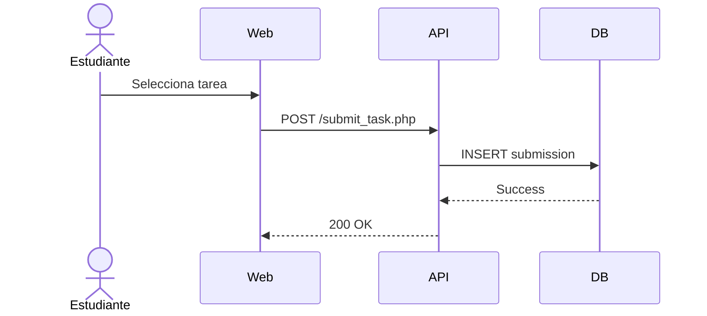

# Documentación Técnica Integral - Academia Musical JACQUIN 🎶

Este documento consolida toda la ingeniería y diseño del sistema para su exportación a PDF.

---

## 1. Informe de Evaluación de Requerimientos
> Archivo original: `6_Requirements_Evaluation_Report.md`

El sistema demuestra una madurez alta en la lógica de control académica y una arquitectura sólida en el backend basada en PHP nativo.

### Matriz de Cumplimiento
| Requerimiento | Estado | Observación |
| :--- | :--- | :--- |
| **Autenticación** | ✅ Cumplido | Implementado vía `login.php` y `auth_helper.php`. |
| **Inscripciones** | ✅ Cumplido | Lógica robusta en `admin_enroll_student.php`. |
| **Seguridad** | ✅ Cumplido | Uso de `PDO` y manejo de sesiones. |
| **Inventario** | ⚠️ Parcial | Requiere mayor integración visual en el frontend. |

---

## 2. Vista General de la Arquitectura
> Archivo original: `0_Architecture_Overview.md`

### Stack Tecnológico
- **Frontend**: HTML5, CSS3, JavaScript.
- **Backend**: PHP 8.
- **Base de Datos**: MySQL / MariaDB.

---

## 3. Diagrama de Entidad Relación (BD)
> Archivo original: `1_Entity_Relationship_Diagram.md`

---

## 4. Casos de Uso
> Archivo original: `3_Use_Cases.md`

---

## 5. Diagramas de Secuencia
> Archivo original: `5_Sequence_Diagrams.md`

---
*Firma: Equipo de Ingeniería Antigravity AI*
