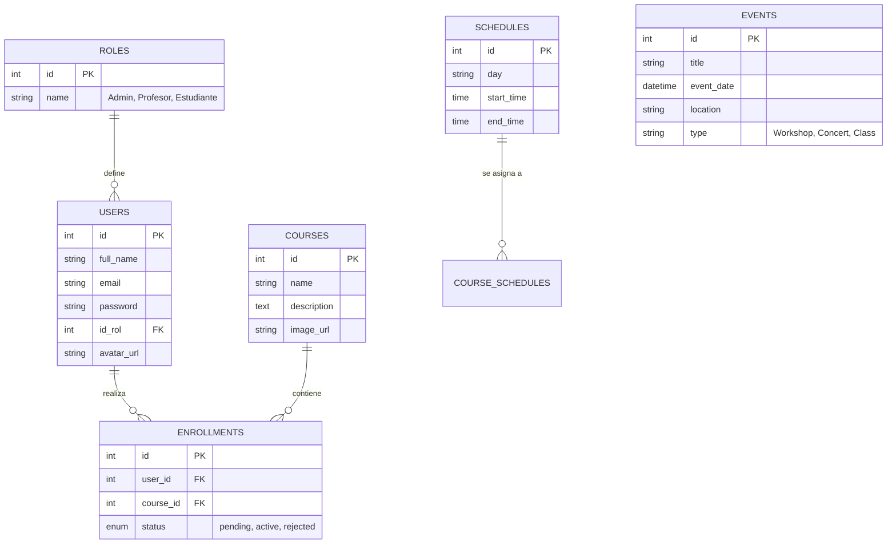
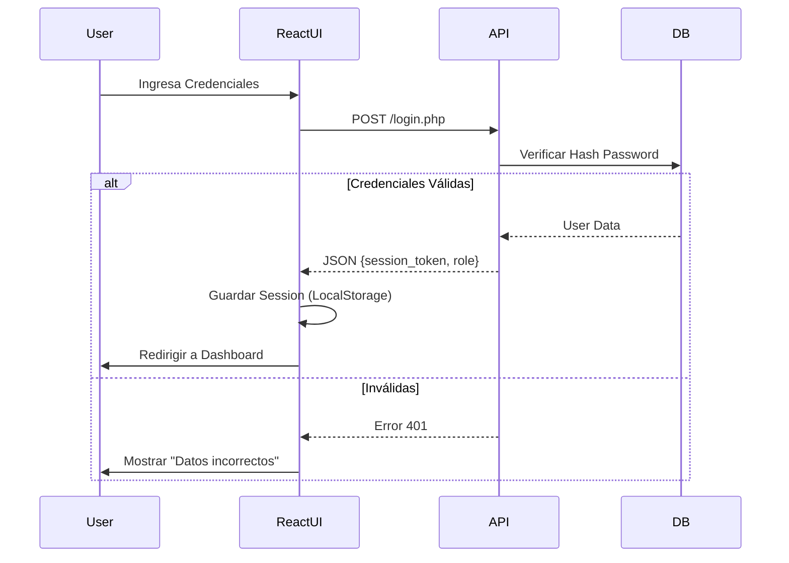
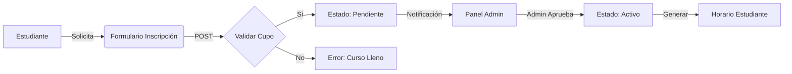

# 🏛️ Documentación Técnica - Project Jacquin

## 1. Arquitectura del Sistema
El sistema **Jacquin** sigue una arquitectura **Cliente-Servidor** desacoplada:

*   **Frontend**: Single Page Application (SPA) construida con **React.js** (Vite).
*   **Backend**: API RESTful construida con **PHP 8** nativo (sin frameworks pesados).
*   **Base de Datos**: **MySQL/MariaDB** relacional.
*   **Infraestructura**: Despliegue en InfinityFree (Hosting compartido) + Túnel Zrok para desarrollo local.

### Diagrama de Componentes
```mermaid
graph TD
    Client[Cliente Web (React)] <-->|JSON/HTTPS| API[API PHP Bridge]
    API <-->|SQL| DB[(MySQL Database)]
    API <--> FS[File System (Assets/Uploads)]
```

## 2. Diagrama Entidad-Relación (ERD)
Esquema inferido de la lógica de negocio actual:



## 3. Diagramas de Flujo de Procesos

### 3.1 Autenticación y Acceso


### 3.2 Gestión de Matrícula (Enrollment)


## 4. Requisitos del Sistema

### 4.1 Requisitos Funcionales (RF)
| ID | Requisito | Descripción |
| :--- | :--- | :--- |
| **RF-01** | **Gestión de Usuarios** | Registro, Login, Recuperación de contraseña y edición de perfil. |
| **RF-02** | **Roles y Permisos** | Diferenciación estricta entre Admin, Profesor y Estudiante. |
| **RF-03** | **Catalogo de Cursos** | Visualización pública de programas y detalle académico. |
| **RF-04** | **Inscripciones** | Flujo de solicitud de matrícula con aprobación administrativa. |
| **RF-05** | **Gestión de Eventos** | CRUD de eventos (conciertos, talleres) visible en el calendario. |
| **RF-06** | **Panel de Control** | Dashboard administrativo para gestión global (KPIs, tablas). |

### 4.2 Requisitos No Funcionales (RNF)
| ID | Requisito | Descripción |
| :--- | :--- | :--- |
| **RNF-01** | **Rendimiento** | Carga inicial del Hero < 1.5s (LCP). Imágenes optimizadas (WebP). |
| **RNF-02** | **Seguridad** | Passwords con Hash (Bcrypt). Protección CORS y saneamiento SQL. |
| **RNF-03** | **Disponibilidad** | Sistema resiliente a fallos de conexión (Manejo de estados offline básico). |
| **RNF-04** | **Usabilidad** | Diseño Responsive (Mobile First) adaptable a tablets y desktops. |
| **RNF-05** | **Escalabilidad** | Arquitectura modular que permite añadir nuevos módulos (ej. Pagos) sin refactorización total. |

## 5. Estructura de Archivos y Recursos (Assets)
A partir de la auditoría de febrero 2026, los recursos se han centralizado para optimización y compatibilidad con hosting compartido:

*   **Ruta Raíz Assets**: `web_page/pages/public/assets/`
    *   **images/**:
        *   `avatars/`: Contiene `default_avatar.svg`.
        *   `hero/`: Imágenes de la sección principal.
        *   `about/`: Recursos de la sección "Nosotros".
        *   `programs/`: Miniaturas de cursos.
        *   `values/`: Iconografía de valores institucionales.
    *   **fonts/**: Colección de fuentes oficiales del Brandbook (Poppins, HelveticaNeue, Marion).

### Beneficios:
1.  **Compatibilidad Hosting**: Rutas relativas consistentes en InfinityFree.
2.  **Rendimiento**: Mejor cacheo de recursos estáticos.
3.  **Orden**: Eliminación de carpetas duplicadas (`web_page/assets/`, `web_page/pages/images/`).

## 6. Historial de Cambios (Bitácora Diaria)
*   **Fecha:** 2026-02-21
*   **Auditoría UI**: Corrección masiva de rutas de avatares en paneles de Docente y Estudiante.
*   **Consolidación**: Eliminación de archivos huérfanos y legacy (`_LEGACY_ARCHIVE` movido a backups).
*   **Documentación**: Generación de manuales detallados por roles en la carpeta `technical/manuals/`.
*   **InfinityFree Prep**: Ajuste de `PathHelper.php` y variables de entorno para despliegue productivo.
